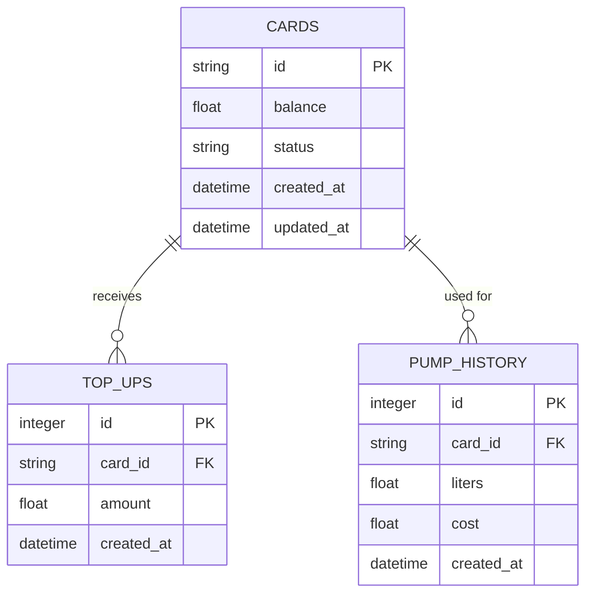

# KanduTap Water Dispensing System

## Use Case Diagram

```mermaid
flowchart TD
    %% Actors
    User((User))
    Admin((Administrator))
    
    %% User use cases
    UC1[Register New Card]
    UC2[Authenticate Card]
    UC3[View Card Balance]
    UC4[View Top-up History]
    UC5[Add Top-up to Card]
    UC6[Use Card for Water Dispensing]
    UC7[View Pump History]
    UC8[Navigate Between Pages]
    UC9[Check Card Status]
    
    %% Admin use cases
    UC10[Admin Login]
    UC11[View Top Users]
    UC12[View Statistics Reports]
    UC13[Generate Reports]
    UC14[Add New Card]
    UC15[View All Cards]
    UC16[Enable/Disable Cards]
    
    %% Extension use cases
    EX1[Handle Failed Authentication]
    EX2[Handle Insufficient Balance]
    EX3[Handle Disabled Cards]
    EX4[Verify Card]
    
    %% User connections
    User -->|performs| UC1
    User -->|performs| UC2
    User -->|performs| UC3
    User -->|performs| UC4
    User -->|performs| UC5
    User -->|performs| UC6
    User -->|performs| UC7
    User -->|performs| UC8
    User -->|performs| UC9
    
    %% Admin connections
    Admin -->|performs| UC10
    Admin -->|performs| UC11
    Admin -->|performs| UC12
    Admin -->|performs| UC13
    Admin -->|performs| UC14
    Admin -->|performs| UC15
    Admin -->|performs| UC16
    
    %% Extensions and includes
    UC2 -->|extends| EX1
    UC6 -->|extends| EX2
    UC2 -->|includes| EX4
    EX4 -->|includes| UC9
    UC9 -->|includes| EX3
    
    %% Admin login is required for admin functions
    UC10 -->|includes| UC11
    UC10 -->|includes| UC12
    UC10 -->|includes| UC13
    UC10 -->|includes| UC14
    UC10 -->|includes| UC15
    UC10 -->|includes| UC16
    
    %% Styling
    classDef userCase fill:#b7e1cd,stroke:#82c7a5,color:#333
    classDef adminCase fill:#c9daf8,stroke:#a4c2f4,color:#333
    classDef extension fill:#f9cb9c,stroke:#f6b26b,color:#333
    
    class UC1,UC2,UC3,UC4,UC5,UC6,UC7,UC8,UC9 userCase
    class UC10,UC11,UC12,UC13,UC14,UC15,UC16 adminCase
    class EX1,EX2,EX3,EX4 extension
```

## System Overview

KanduTap is a smart water dispensing system that allows users to dispense water using RFID cards. The system includes user authentication, balance management, top-up functionality, and an admin dashboard for monitoring and management.

## Database Schema (ERD)

### Entity Descriptions

1. **CARDS**
   - Primary entity storing card information
   - Contains card ID, balance, status (active/disabled), and timestamps
   - Each card has a unique identifier (RFID number)

2. **TOP_UPS**
   - Records all top-up transactions
   - References the card that received the top-up
   - Stores amount and timestamp of each transaction

3. **PUMP_HISTORY**
   - Tracks water dispensing activities
   - References the card used for dispensing
   - Records volume (liters), cost, and timestamp

### Relationships

- A card can have multiple top-ups (one-to-many)
- A card can have multiple pump history records (one-to-many)
- Top-ups and pump history both depend on cards (foreign key relationships)
