# KanduTap Water Dispensing System - Admin Flow Diagram

```plantuml
@startuml
skinparam backgroundColor white
skinparam handwritten false
skinparam defaultFontName Arial
skinparam defaultFontSize 12
skinparam roundCorner 15
skinparam arrowColor #666666

skinparam activity {
  BackgroundColor #ea4335
  BorderColor #c53929
  FontColor white
  ArrowColor #666666
}

skinparam activityDiamond {
  BackgroundColor #f1c232
  BorderColor #f1c232
  FontColor black
}

title KanduTap Water Dispensing System - Admin Flow

start

:Admin accesses the management system;

:Enter admin credentials;

if (Valid credentials?) then (no)
  :Display authentication error;
  :Prompt to try again;
  if (Retry?) then (yes)
    :Enter admin credentials again;
  else (no)
    :End session;
    stop
  endif
else (yes)
  :Display admin dashboard;
  
  partition "Admin Dashboard" {
    repeat
      :Display admin options:
      1. User Management
      2. Card Management
      3. Pump Management
      4. Reports & Analytics
      5. System Settings
      6. Logout;
      
      :Admin selects an option;
      
      switch (Selected option)
        case (User Management)
          :Display user management options:
          1. View All Users
          2. Search Users
          3. Add New User
          4. Edit User
          5. Deactivate/Activate User
          6. Back to Dashboard;
          
          :Admin selects user management action;
          
          switch (Selected user action)
            case (View All Users)
              :Display paginated list of all users;
            case (Search Users)
              :Enter search criteria;
              :Display matching users;
            case (Add New User)
              :Enter new user details;
              :Create user account;
              :Link to new/existing card;
              :Display confirmation;
            case (Edit User)
              :Search for user;
              :Display user details;
              :Edit user information;
              :Save changes;
              :Display confirmation;
            case (Deactivate/Activate User)
              :Search for user;
              :Toggle user status;
              :Display confirmation;
            case (Back to Dashboard)
              :Return to admin dashboard;
          endswitch
          
        case (Card Management)
          :Display card management options:
          1. View All Cards
          2. Search Cards
          3. Register New Card
          4. Link/Unlink Card to User
          5. Set Card Rates
          6. Deactivate/Activate Card
          7. Back to Dashboard;
          
          :Admin selects card management action;
          
          switch (Selected card action)
            case (View All Cards)
              :Display paginated list of all cards;
            case (Search Cards)
              :Enter search criteria;
              :Display matching cards;
            case (Register New Card)
              :Enter card ID;
              :Register card in system;
              :Link to user (optional);
              :Display confirmation;
            case (Link/Unlink Card to User)
              :Search for card;
              :Display current linkage;
              :Modify user linkage;
              :Save changes;
              :Display confirmation;
            case (Set Card Rates)
              :Display current rate settings;
              :Modify rate settings;
              :Save changes;
              :Display confirmation;
            case (Deactivate/Activate Card)
              :Search for card;
              :Toggle card status;
              :Display confirmation;
            case (Back to Dashboard)
              :Return to admin dashboard;
          endswitch
          
        case (Pump Management)
          :Display pump management options:
          1. View All Pumps
          2. Add New Pump
          3. Configure Pump Settings
          4. View Pump Statistics
          5. Maintenance Mode
          6. Back to Dashboard;
          
          :Admin selects pump management action;
          
          switch (Selected pump action)
            case (View All Pumps)
              :Display list of all pumps with status;
            case (Add New Pump)
              :Enter pump details;
              :Register pump in system;
              :Display confirmation;
            case (Configure Pump Settings)
              :Select pump;
              :Modify flow rate, volume limits, etc.;
              :Save changes;
              :Display confirmation;
            case (View Pump Statistics)
              :Select pump;
              :Display usage statistics;
              :Generate maintenance alerts if needed;
            case (Maintenance Mode)
              :Select pump;
              :Toggle maintenance mode;
              :Display confirmation;
            case (Back to Dashboard)
              :Return to admin dashboard;
          endswitch
          
        case (Reports & Analytics)
          :Display reports & analytics options:
          1. Usage Reports
          2. Financial Reports
          3. User Activity
          4. System Performance
          5. Export Data
          6. Back to Dashboard;
          
          :Admin selects reports action;
          
          switch (Selected reports action)
            case (Usage Reports)
              :Set date range;
              :Generate usage statistics;
              :Display visualizations;
            case (Financial Reports)
              :Set date range;
              :Generate financial data;
              :Display revenue, transactions, etc.;
            case (User Activity)
              :Set filters;
              :Generate user activity report;
              :Display top users, inactive users, etc.;
            case (System Performance)
              :Generate system metrics;
              :Display uptime, response times, etc.;
            case (Export Data)
              :Select report type;
              :Choose export format (CSV, PDF, etc.);
              :Generate and download report;
            case (Back to Dashboard)
              :Return to admin dashboard;
          endswitch
          
        case (System Settings)
          :Display system settings options:
          1. General Settings
          2. Security Settings
          3. Notification Settings
          4. Backup & Restore
          5. System Logs
          6. Back to Dashboard;
          
          :Admin selects settings action;
          
          switch (Selected settings action)
            case (General Settings)
              :Modify general system parameters;
              :Save changes;
              :Display confirmation;
            case (Security Settings)
              :Modify security parameters;
              :Update access controls;
              :Save changes;
              :Display confirmation;
            case (Notification Settings)
              :Configure alert thresholds;
              :Set notification methods;
              :Save changes;
              :Display confirmation;
            case (Backup & Restore)
              :Create system backup;
              :View backup history;
              :Restore from backup (if needed);
            case (System Logs)
              :View system activity logs;
              :Filter by date/type/severity;
              :Export logs (optional);
            case (Back to Dashboard)
              :Return to admin dashboard;
          endswitch
          
        case (Logout)
          :End admin session;
          :Return to login screen;
      endswitch
      
    repeat while (Continue admin session?) is (yes)
  }
endif

:Log admin actions;
:Display logout confirmation;

stop

@enduml
```

## Diagram Description

This flowchart illustrates the complete admin journey through the KanduTap Water Dispensing System, from authentication to performing various administrative tasks.

### Key Admin Flows:
1. **Authentication**: Admin login process with error handling
2. **Dashboard Navigation**: Central hub for accessing all admin functions
3. **User Management**: Complete user account administration
4. **Card Management**: Card registration, linking, and rate setting
5. **Pump Management**: Water dispenser configuration and monitoring
6. **Reports & Analytics**: Data analysis and reporting capabilities
7. **System Settings**: Configuration of system parameters and security

The diagram includes detailed sub-flows for each major administrative function, showing the complete range of actions available to system administrators. Decision points handle various scenarios such as authentication failures and confirmation prompts.
