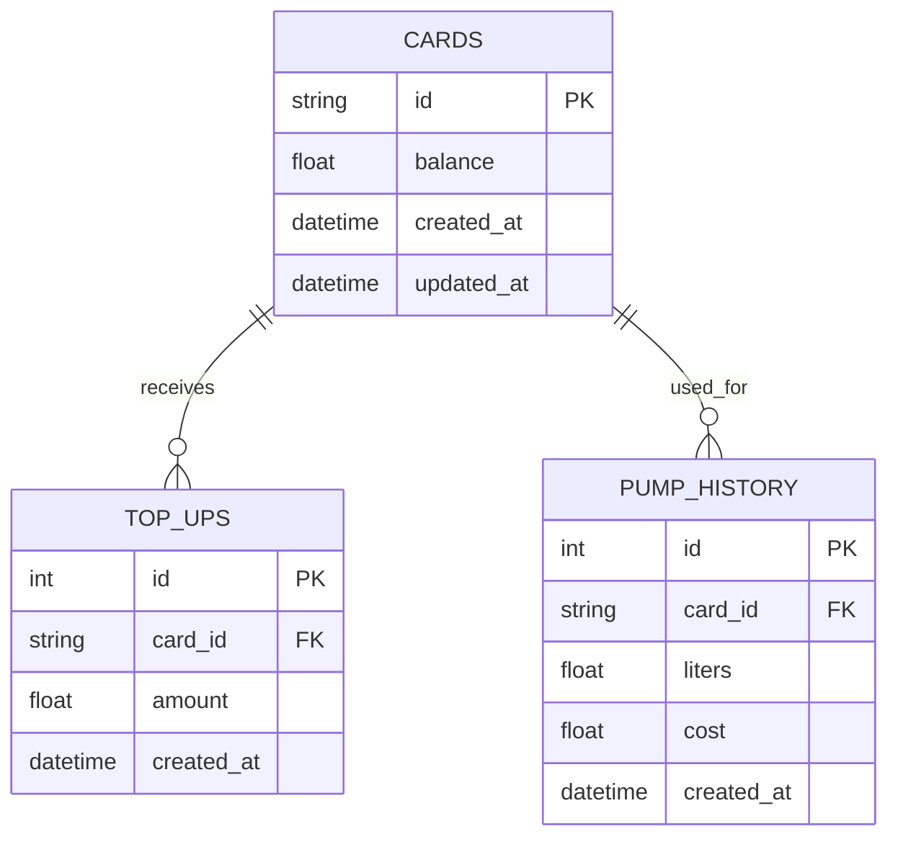

# KanduTap Entity Relationship Diagram

## Entity Descriptions

### CARDS
- **id**: Unique identifier for the card (Primary Key)
- **balance**: Current monetary balance available on the card
- **created_at**: Timestamp when the card was created
- **updated_at**: Timestamp when the card was last updated

### TOP_UPS
- **id**: Unique identifier for the top-up transaction (Primary Key)
- **card_id**: Reference to the card receiving the top-up (Foreign Key)
- **amount**: Monetary amount added to the card
- **created_at**: Timestamp when the top-up was processed

### PUMP_HISTORY
- **id**: Unique identifier for the pump transaction (Primary Key)
- **card_id**: Reference to the card used for the transaction (Foreign Key)
- **liters**: Volume of fuel dispensed
- **cost**: Monetary cost of the fuel dispensed
- **created_at**: Timestamp when the pumping occurred

## Relationships

1. A CARD can receive many TOP_UPS (one-to-many)
2. A CARD can be used for many PUMP_HISTORY transactions (one-to-many)
