# KanduTap Use Case Diagram

```mermaid
graph TD
    %% Actors
    Customer((Customer))
    Admin((Admin))
    
    %% Use Cases
    UC1[Authenticate Card]
    UC2[View Card Balance]
    UC3[View Top-up History]
    UC4[Add Top-up to Card]
    UC5[Use Card for Fuel Purchase]
    UC6[View Pump History]
    
    UC7[Login to Admin Dashboard]
    UC8[View System Analytics]
    UC9[Monitor Revenue & Volume]
    UC10[View Top Users]
    UC11[Analyze Usage Patterns]
    UC12[Add New Card]
    
    %% Relationships - Customer
    Customer -->|uses| UC1
    Customer -->|performs| UC2
    Customer -->|reviews| UC3
    Customer -->|performs| UC4
    Customer -->|performs| UC5
    Customer -->|reviews| UC6
    
    %% Relationships - Admin
    Admin -->|performs| UC7
    Admin -->|monitors| UC8
    Admin -->|tracks| UC9
    Admin -->|identifies| UC10
    Admin -->|studies| UC11
    Admin -->|creates| UC12
    
    %% Dependencies
    UC2 -->|requires| UC1
    UC3 -->|requires| UC1
    UC4 -->|requires| UC1
    UC5 -->|requires| UC1
    UC6 -->|requires| UC1
    
    UC8 -->|requires| UC7
    UC9 -->|requires| UC7
    UC10 -->|requires| UC7
    UC11 -->|requires| UC7
    UC12 -->|requires| UC7
    
    %% System Boundaries
    subgraph Customer Operations
        UC1
        UC2
        UC3
        UC4
        UC5
        UC6
    end
    
    subgraph Administrative Operations
        UC7
        UC8
        UC9
        UC10
        UC11
        UC12
    end

    classDef customer fill:#e1f5fe,stroke:#01579b,stroke-width:2px
    classDef admin fill:#f3e5f5,stroke:#6a1b9a,stroke-width:2px
    
    class UC1,UC2,UC3,UC4,UC5,UC6 customer
    class UC7,UC8,UC9,UC10,UC11,UC12 admin
```

## Use Case Descriptions

### Customer Operations

1. **Authenticate Card**: Customer enters card ID to access card-specific functionality.
2. **View Card Balance**: Customer checks the current balance available on their card.
3. **View Top-up History**: Customer reviews past top-up transactions on their card.
4. **Add Top-up to Card**: Customer adds funds to their card through manual entry or quick top-up options.
5. **Use Card for Fuel Purchase**: Customer uses their card to pay for fuel at a pump.
6. **View Pump History**: Customer reviews their past fuel purchase transactions.

### Administrative Operations

7. **Login to Admin Dashboard**: Administrator authenticates to access the admin dashboard.
8. **View System Analytics**: Administrator views comprehensive system statistics and metrics.
9. **Monitor Revenue & Volume**: Administrator tracks daily revenue and fuel volume trends.
10. **View Top Users**: Administrator identifies the most active cards by usage volume.
11. **Analyze Usage Patterns**: Administrator studies hourly distribution and user segmentation data.
12. **Add New Card**: Administrator creates new cards with initial balance in the system.
