# KanduTap Water Dispensing System Use Case Diagram

```plantuml
@startuml

skinparam actorStyle awesome
skinparam usecaseStyle roundbox
skinparam packageStyle rectangle
skinparam shadowing false
skinparam handwritten false

' Color definitions
skinparam actor {
  BackgroundColor #1a73e8
  BorderColor #4285f4
  FontColor black
}

skinparam usecase {
  BackgroundColor #1a73e8
  BorderColor #4285f4
  FontColor white
}

' Actors
actor "User" as user
actor "Admin" as admin

' System boundary
rectangle "KanduTap Water Dispensing System" {
  ' Common use cases
  usecase "Verify Card" as verifyCard
  usecase "Handle Failed Authentication" as failAuth
  usecase "Handle Insufficient Balance" as insuffBalance
  
  ' User use cases
  usecase "Authenticate Card" as authCard
  usecase "Register New User" as regUser
  usecase "View Card Balance" as viewBalance
  usecase "Add Top-up to Card" as addTopup
  usecase "View Top-up History" as viewTopupHistory
  usecase "Use Card for Water Dispensing" as useCard
  usecase "View Pump History" as viewPumpHistory
  usecase "Update User Profile" as updateProfile
  
  ' Admin use cases
  usecase "Admin Login" as adminLogin
  usecase "View Top Users" as viewTopUsers
  usecase "View Statistics Reports" as viewStats
  usecase "Generate System Reports" as genReports
  usecase "Add New Card" as addCard
  usecase "Manage Pump Settings" as managePump
  usecase "Manage Card Rates" as manageRates
  usecase "Deactivate/Reactivate Cards" as manageCards
  
  ' Relationships - User
  user --> authCard
  user --> regUser
  user --> viewBalance
  user --> addTopup
  user --> viewTopupHistory
  user --> useCard
  user --> viewPumpHistory
  user --> updateProfile
  
  ' Relationships - Admin
  admin --> adminLogin
  admin --> viewTopUsers
  admin --> viewStats
  admin --> genReports
  admin --> addCard
  admin --> managePump
  admin --> manageRates
  admin --> manageCards
  
  ' Include relationships (mandatory functionality)
  authCard ..> verifyCard : <<include>>
  viewBalance ..> verifyCard : <<include>>
  addTopup ..> verifyCard : <<include>>
  useCard ..> verifyCard : <<include>>
  authCard ..> failAuth : <<include>>
  useCard ..> insuffBalance : <<include>>
  viewStats ..> genReports : <<include>>
  
  ' Extend relationships (optional functionality)
  viewTopupHistory ..> addTopup : <<extend>>
  viewPumpHistory ..> useCard : <<extend>>
  manageCards ..> addCard : <<extend>>
}

@enduml
```

## Diagram Description

This UML use case diagram illustrates the interactions between users, administrators, and the KanduTap system. The diagram clearly shows the different functionalities available to each actor type.

### User Actor
The regular user can:
- Register and login to the system
- Browse, accept, and complete tasks
- Track their history and earned rewards
- Redeem rewards for completing tasks
- Update their profile information
- Provide feedback on completed tasks

### Admin Actor
The administrator can:
- Login to the system
- Manage user accounts
- Create and manage tasks
- Review and approve/reject task submissions
- Manage the rewards system
- Generate reports and analytics
- Configure system settings

### Relationships
- Include relationships show dependencies between use cases
- Extend relationships show optional extensions to base use cases
