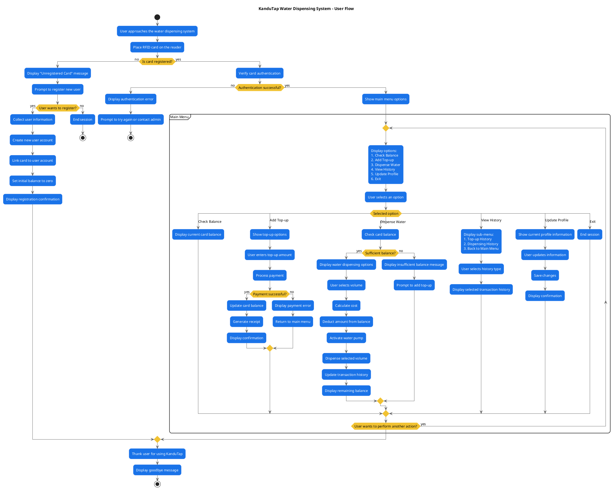

# KanduTap Water Dispensing System - User Flow Diagram

## Diagram Description

This flowchart illustrates the complete user journey through the KanduTap Water Dispensing System, from initial card authentication to performing various actions within the system.

### Key User Flows:
1. **Card Authentication**: Verifies if the card is registered and authenticated
2. **New User Registration**: Process for registering new users and linking cards
3. **Main Menu Navigation**: Shows the different options available to users
4. **Balance Check**: Simple flow to view current card balance
5. **Top-up Process**: Steps for adding credit to the card
6. **Water Dispensing**: Process for selecting and dispensing water
7. **History Viewing**: Options to view transaction history
8. **Profile Management**: Flow for updating user information

The diagram includes decision points for handling various scenarios such as authentication failures, insufficient balance, and payment processing errors.
